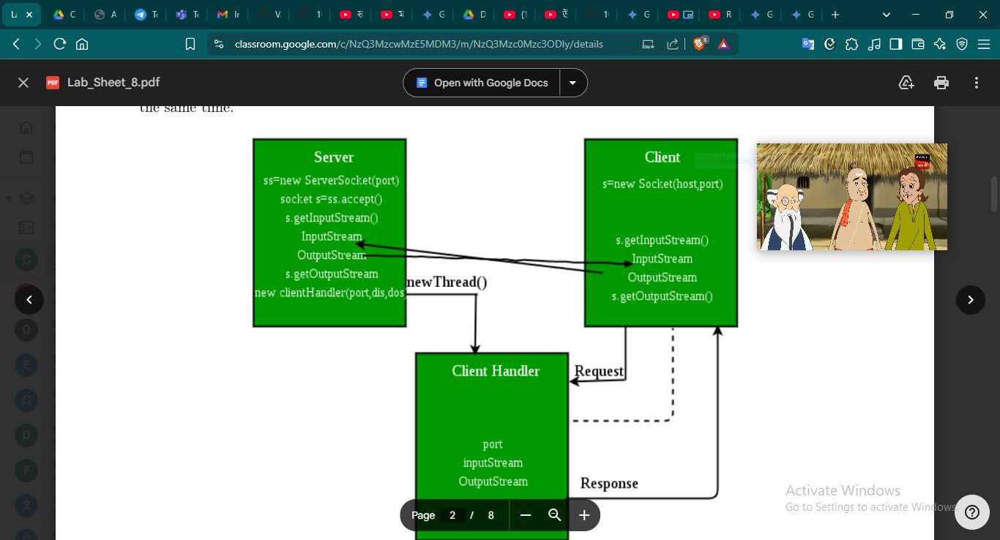

# Multi-Threading in Socket Programming
##

## Server-Client Algorithm

### Server.java
1. Create ServerSocket instance
2. While(`TRUE`)
3. Socket = `ss.accept()`
4. Create `DOS` and `DIS`
5. Create Thread = ClientHandler(`s`, `dos`, `dis`)

### Client.java
1. Create Socket(localhost, port);
2. Create `DOS`, `DIS` and `Scanner` instance
3. While(`True`)
4. `DIS.readUTF();`
5. `DOS.writeUTF();`
6. if(`True`)-EXIT

### ClientHandler.java
1. Call Constructor
2. @Override run()
3. While(`True`)
4. `DIS.readUTF();`
5. `DOS.writeUTF();`
6. if(`True`)-EXIT

## Run Project in Intellij IDEA
### 1. Ensure Your Project Structure is Set Up:
- Make sure your `Server.java`, `Client.java`, and `ClientHandler.java` files are within the source folders of your `IntelliJ IDEA` project. The standard location for source files is usually a directory named `src`. If you have packages, ensure the directory structure reflects your package hierarchy (e.g., if `Server.java` is in `com.example.server`, the path would be `src/com/example/server/Server.java`).

### 2. Running the Server:
- Locate the `Server.java` file in your Project view.
- `Right-click` on the `Server.java` file.
- From the context menu, select "Run `Server.main()`".
  - IntelliJ IDEA will automatically create a Run Configuration for your Server class if one doesn't exist. This configuration specifies the main class to execute.
- You should see the output of your server application in the `Run` tool window (usually at the bottom of the IntelliJ IDEA window).

### 3. Running the Client:

- Locate the `Client.java` file in your Project view.
- `Right-click` on the `Client.java` file.
- From the context menu, select "Run `Client.main()`".
  - Similarly, IntelliJ IDEA will create a Run Configuration for your Client class.
- You should see the output of your client application in a separate "Run" tool window.

### Running Multiple Instances (if needed for testing):
If you want to run multiple client instances to test your server's multithreading capabilities, you can do the following:

- After running the Client once, go to the `Run` menu in IntelliJ IDEA.
- Select `Run...`
- In the `Run/Debug Configurations` dialog, you should see the Client configuration you just created.
- Select the Client configuration and click the `Run` button again (or press `Shift + F10`). This will launch another instance of your client. You can repeat this process as many times as needed.

## Images
