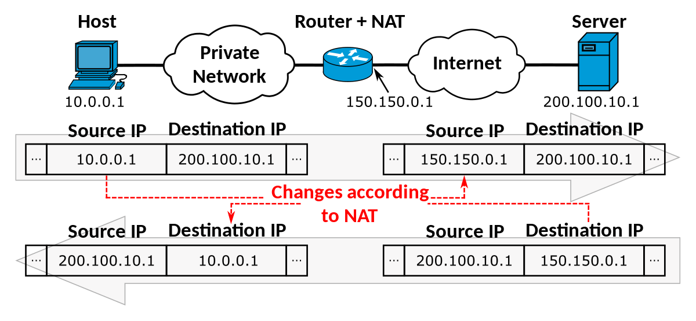

# Dynamic Routing | NAT | Network Address Translation
Network Address Translation (NAT) is a process that allows multiple devices on a private network to share a single public IP address when communicating with the internet.

## How its works
1. **Private IP Addresses:**
Devices within a private network (like your home network) use private IP addresses, which are not recognized by the internet.

2. **NAT Router:**
When a device on the private network wants to access the internet, it sends its data to the router, which acts as the gateway.

3. **Address Translation:**
The router's NAT function intercepts the data and replaces the private IP address of the source device with the public IP address assigned to the router.

4. **Communication:**
The data is then sent to the destination server on the internet.

5. **Response:**
When the server responds, the data is sent back to the router, which translates the public IP address back to the original private IP address of the receiving device.

6. **Forwarding:**
The router then forwards the data to the appropriate device on the private network. 

## Types of NAT:
- **Static NAT:** Maps a specific internal IP address to a `unique external` IP address. 
- **Dynamic NAT:** Maps internal IP addresses to a pool of external IP addresses. 
- **Port Address Translation (PAT):** Uses port numbers to distinguish between multiple connections from the `same public IP` address.


## NAT command

> Static NAT
```shell
ip nat inside source static <local ip> <global ip>
```

## Images
