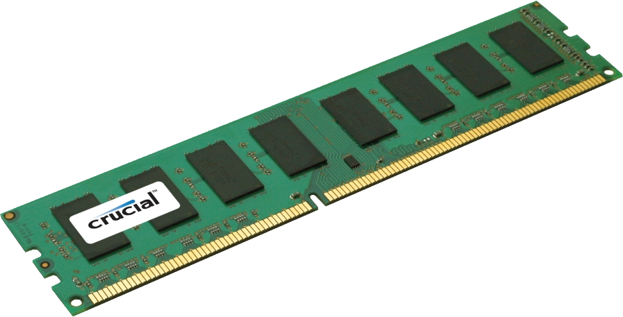

# **Memory Allocation Simulator Documentation**

## **1. C++ Version**

### **Description**
Simulates the **First-Fit memory allocation** strategy where processes are allocated to the first available memory block that fits their size.

### **Files**
- `memory_alloc.cpp` (main implementation file)

### **Compilation & Execution**
```bash
g++ memory_alloc.cpp -o alloc
./alloc
```

### **Input Format**
```
Enter number of blocks: [n]
Block [i] size: [size]

Enter number of processes: [m]
Process [j] required size: [size]
```

### **Output Format**
```
-------------------------------------------------------------
| Processes | Process Size | Blocks | Block Size | Allocated | Int. Frag. |
-------------------------------------------------------------
|    1      |    275       |  1     |    280     |   YES     |    5       |
|    2      |    400       |  --    |    --      |   NO      |    --      |
-------------------------------------------------------------
```

### **Key Features**
- Uses arrays to track block allocation
- Calculates internal fragmentation (`block_size - process_size`)
- Preserves original block order (First-Fit)

---

## **2. Bash Version**

### **Description**
A shell script implementation of the same algorithm, suitable for Linux/WSL/Git Bash environments.

### **Files**
- `memory_alloc.sh` (main script file)

### **Execution**
```bash
chmod +x memory_alloc.sh
./memory_alloc.sh
```

### **Input/Output**
Same as C++ version, with additional features:
- Uses `read -p` for inline prompts
- Handles unallocated processes gracefully with `--` placeholders

### **Key Differences**
- Uses Bash arrays instead of C++ structs
- Built-in error handling for invalid inputs
- No compilation needed (interpreted script)

---

## **Common Algorithm Logic (Both Versions)**
1. **Input Phase**  
   - Accept memory block sizes  
   - Accept process memory requirements  

2. **Allocation Phase**  
   ```plaintext
   for each process:
       find first unallocated block ≥ process size
       mark block as allocated
       calculate fragmentation (block_size - process_size)
   ```

3. **Output Phase**  
   - Tabular results showing allocations  
   - Visual distinction between allocated/not allocated  

---

## **Use Cases**
- OS memory management demonstrations
- Resource allocation simulations
- Educational tool for First-Fit algorithm

## **Limitations**
- No compaction/handling of external fragmentation
- Static array sizes (MAX=100 in C++ version)

## **Extending the Project**
- Add **Best-Fit/Worst-Fit** modes
- Implement dynamic memory (linked lists in C++)
- Add graphical output (e.g., ASCII memory maps)

---

